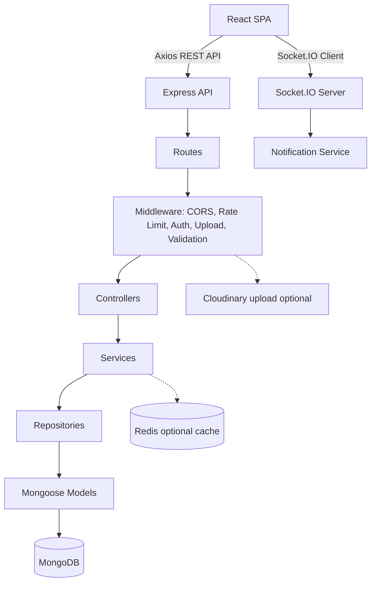

<h1 align="center">ITForum - Diễn đàn hỏi đáp dành cho sinh viên IT</h1>

<p align="center">
  Ứng dụng web full-stack giúp sinh viên Công nghệ Thông tin đặt câu hỏi, chia sẻ kinh nghiệm,
  bình chọn nội dung hữu ích, lưu trữ tài liệu và tương tác với cộng đồng theo thời gian thực.
</p>

<p align="center">
  <a href="#giới-thiệu">Giới thiệu</a> |
  <a href="#tính-năng-chính">Tính năng</a> |
  <a href="#công-nghệ-sử-dụng">Công nghệ</a> |
  <a href="#kiến-trúc-hệ-thống">Kiến trúc</a> |
  <a href="#cài-đặt-và-chạy-local">Cài đặt</a> |
  <a href="#api-endpoints">API</a> |
  <a href="#testing">Testing</a>
</p>

<p align="center">
  
  
  
  
  
  
</p>

---

## Giới Thiệu

**ITForum** là nền tảng Q&A dành cho sinh viên IT, lấy cảm hứng từ mô hình cộng đồng của Stack Overflow và Reddit. Hệ thống tập trung vào việc tạo môi trường trao đổi kiến thức có kiểm duyệt, có cơ chế uy tín cá nhân và có các công cụ quản trị phù hợp cho một sản phẩm web full-stack.

Người dùng có thể đăng bài viết dạng câu hỏi hoặc lời khuyên, bình luận nhiều cấp, bình chọn, lưu bài viết vào bộ sưu tập, theo dõi thông báo real-time và ủng hộ tác giả bài viết. Admin có bảng điều khiển để quản lý người dùng, bài viết, tag, report, donation, cấu hình hệ thống và audit log.

## Tính Năng Chính

### Người dùng và xác thực

| Nhóm tính năng | Mô tả |
|---|---|
| Đăng ký, OTP, đăng nhập | Đăng ký bằng email, xác thực OTP, đăng nhập bằng Access Token + Refresh Token lưu trong cookie HttpOnly |
| Quên mật khẩu | Gửi OTP reset password, xác thực OTP và đặt lại mật khẩu |
| Hồ sơ cá nhân | Cập nhật avatar, bio, chuyên ngành, số điện thoại và thông tin cá nhân |
| Quản lý tài khoản | Đổi mật khẩu, vô hiệu hóa tài khoản, lên lịch xóa tài khoản, hủy xóa tài khoản, kích hoạt lại bằng OTP |
| Hồ sơ công khai | Xem trang tác giả và tìm kiếm tác giả |

### Bài viết, bình luận và tương tác

| Nhóm tính năng | Mô tả |
|---|---|
| Bài viết | Tạo bài viết dạng `question` hoặc `advice`, hỗ trợ Markdown và đính kèm ảnh/video |
| Bình luận | Bình luận lồng nhau, chỉnh sửa, xóa, react và đánh dấu câu trả lời tốt nhất |
| Vote và reaction | Tách riêng upvote/downvote với like/dislike |
| Tìm kiếm và lọc | Lọc theo tag, loại bài viết, trạng thái và sắp xếp danh sách bài viết |
| Nội dung liên quan | Gợi ý bài viết liên quan, trending today và top upvoted |
| Thùng rác | Xóa mềm, khôi phục và xóa vĩnh viễn bài viết |

### Cộng đồng và hệ sinh thái

| Nhóm tính năng | Mô tả |
|---|---|
| Tag | Quản lý chủ đề bằng tag và slug không dấu |
| Saved posts | Lưu bài viết vào nhiều bộ sưu tập cá nhân, có Redis cache tùy chọn |
| Reputation | Ghi nhận điểm uy tín, lịch sử điểm, daily cap và badge |
| Report/Flag | Báo cáo bài viết/bình luận, theo dõi trạng thái xử lý, auto-hide theo ngưỡng cấu hình |
| Donation | Ủng hộ tác giả qua VNPay sandbox hoặc COD/chuyển khoản thủ công kèm ảnh bill |
| Notification | Thông báo real-time bằng Socket.IO |

### Quản trị hệ thống

| Nhóm tính năng | Mô tả |
|---|---|
| Dashboard | Thống kê tổng quan user, post, comment và donation |
| Users | Xem chi tiết, khóa/mở khóa và cập nhật trạng thái tài khoản |
| Posts | Duyệt, ẩn, khôi phục và xử lý bài viết vi phạm |
| Tags | Tạo, sửa, xóa tag và chuẩn hóa slug |
| Reports | Xem flag, chuyển trạng thái ticket và ghi nhận kết quả xử lý |
| Donations | Duyệt hoặc từ chối giao dịch COD, xem toàn bộ giao dịch |
| Settings | Cấu hình điểm reputation, daily cap và ngưỡng auto-hide |
| Audit logs | Lưu vết các thao tác quản trị quan trọng |

## Công Nghệ Sử Dụng

### Frontend

| Công nghệ | Vai trò |
|---|---|
| React 19, React DOM | Xây dựng giao diện SPA |
| Vite 8 | Dev server, build và proxy API/WebSocket local |
| React Router DOM 7 | Routing phía client |
| Redux Toolkit, React Redux | Quản lý state dùng chung |
| Axios | Gọi REST API |
| Socket.IO Client | Nhận thông báo real-time |
| TailwindCSS 3 | Styling và responsive UI |
| Swiper | Slider media trong bài viết |

### Backend

| Công nghệ | Vai trò |
|---|---|
| Node.js, Express 5 | REST API server |
| MongoDB, Mongoose 9 | Database và schema/model |
| Socket.IO | Kênh real-time notification |
| JWT, cookie-parser | Xác thực bằng Access Token + Refresh Token, quản lý phiên đăng nhập |
| bcryptjs | Băm mật khẩu |
| express-validator | Validation request |
| express-rate-limit | Giới hạn tần suất request (14 rate limiter riêng biệt) |
| Multer | Xử lý upload ảnh/video trong memory |
| Nodemailer | Gửi email OTP |
| Redis | Cache tùy chọn cho saved posts |
| Babel Node, Nodemon | Chạy source ES module style trong backend |

## Kiến Trúc Hệ Thống



Backend được tổ chức theo mô hình phân lớp:

| Lớp | Thư mục | Trách nhiệm |
|---|---|---|
| Route | `server/src/route/` | Định nghĩa endpoint và gắn middleware |
| Controller | `server/src/controller/` | Nhận request, gọi service, trả response |
| Service | `server/src/service/` | Xử lý business logic |
| Repository | `server/src/repository/` | Truy vấn database |
| Model | `server/src/model/` | Định nghĩa Mongoose schema, index và relation |
| Middleware | `server/src/middleware/` | Auth, rate limit, upload |
| Validation | `server/src/validation/` | Kiểm tra dữ liệu đầu vào |
| Util | `server/src/util/` | Helper cho email, Cloudinary, sanitize, slugify, moderation |

## Cài Đặt Và Chạy Local

### Yêu cầu

- Node.js 18 trở lên
- npm 9 trở lên
- MongoDB local hoặc MongoDB Atlas
- Redis (tùy chọn)
- Git

### 1. Clone repository

```bash
git clone https://github.com/252MTSE431179-01-Group-15/ITForum.git
cd ITForum
```

### 2. Cài đặt backend

```bash
cd server
npm install
```

Tạo file `server/.env` dựa trên `server/.env.example`:

```bash
cp .env.example .env
```

Nội dung các biến môi trường cần cấu hình:

```env
# MongoDB
MONGODB_URI=mongodb://localhost:27017/it_student_forum

# Server
PORT=5000
NODE_ENV=development

# JWT
JWT_SECRET=change_this_to_a_long_random_secret
JWT_EXPIRES_IN=7d

# Email OTP (SMTP)
EMAIL_HOST=smtp.gmail.com
EMAIL_PORT=587
EMAIL_USER=your_email@gmail.com
EMAIL_PASS=your_gmail_app_password
EMAIL_FROM="IT Forum <no-reply@yourdomain.com>"
RESEND_API_KEY=

# Client
CLIENT_URL=http://localhost:5173

# VNPay sandbox
VNPAY_TMN_CODE=
VNPAY_HASH_SECRET=
VNPAY_URL=https://sandbox.vnpayment.vn/paymentv2/vpcpay.html
VNPAY_RETURN_URL=http://localhost:5173/donate/result

# Cloudinary (tùy chọn)
CLOUDINARY_CLOUD_NAME=
CLOUDINARY_API_KEY=
CLOUDINARY_API_SECRET=

# Redis (tùy chọn)
REDIS_URL=
REDIS_SAVED_TTL=3600
```

> **Ghi chú:**
>
> - `NODE_ENV` ảnh hưởng đến cấu hình cookie (`secure`, `sameSite`). Để `development` khi chạy local.
> - Nếu không cấu hình Cloudinary, upload media sẽ fallback về base64 trong JSON body.
> - Nếu không cấu hình Redis, hệ thống saved posts vẫn hoạt động bình thường với MongoDB.
> - Frontend mặc định gọi API qua Vite proxy tới `http://localhost:5000`.

### 3. Cài đặt frontend

```bash
cd ../client
npm install
```

Frontend mặc định sử dụng Vite proxy (cấu hình trong `vite.config.js`) để chuyển tiếp request `/api` và `/socket.io` tới backend `http://localhost:5000`. Nếu backend chạy ở địa chỉ khác, tạo file `client/.env`:

```env
VITE_API_PROXY_TARGET=http://localhost:5000
```

### 4. Nạp dữ liệu mẫu

Cần đảm bảo MongoDB đang chạy và `server/.env` đã cấu hình đúng `MONGODB_URI`.

> **Cảnh báo:** Lệnh này sẽ **xóa toàn bộ database hiện tại** và seed lại dữ liệu demo.

```bash
cd ../server
npm run seed:demo
```

Dữ liệu demo bao gồm:

- 2 tài khoản admin và 13 tài khoản user
- 25 bài viết mẫu với nội dung Markdown chi tiết và hình ảnh từ Unsplash
- Bình luận lồng nhau lên đến 3-4 cấp, accepted answer, vote và reaction
- 18 tag kỹ thuật với slug chuẩn hóa không dấu
- Lịch sử reputation (hơn 40 bản ghi)
- Report ticket mẫu kèm lịch sử xử lý
- Donation transaction mẫu (VNPay và COD)
- Cấu hình hệ thống mặc định (Reputation Cap, Upvote/Downvote Score, ngưỡng auto-hide)

Tài khoản demo:

| Role | Email | Mật khẩu |
|---|---|---|
| Admin | `admin@itforum.local` | `123456` |
| Admin | `admin2@itforum.local` | `123456` |
| User | `user1@itforum.local` đến `user13@itforum.local` | `123456` |

### 5. Chạy ứng dụng

Terminal 1 — Backend:

```bash
cd server
npm run dev
```

Backend chạy tại:

- API: `http://localhost:5000/api`
- Health check: `http://localhost:5000/api/health`
- Socket.IO: `ws://localhost:5000`

Terminal 2 — Frontend:

```bash
cd client
npm run dev
```

Frontend chạy tại `http://localhost:5173`.

> **Lưu ý:** Vite cấu hình `strictPort: true`, port 5173 phải đang trống. Nếu port đã bị chiếm, Vite sẽ báo lỗi thay vì tự chuyển sang port khác.

## API Endpoints

Tất cả API backend được mount dưới prefix `/api`.

| Prefix | Chức năng |
|---|---|
| `/api/auth` | Đăng ký, OTP, đăng nhập, đăng xuất, quên mật khẩu, kích hoạt lại tài khoản, hủy xóa tài khoản |
| `/api/user` | Hồ sơ cá nhân, đổi mật khẩu, thống kê hoạt động, hồ sơ công khai, vô hiệu hóa/xóa tài khoản |
| `/api/posts` | Bài viết, bình luận, vote, reaction, thùng rác, trending, related |
| `/api/tags` | Danh sách tag |
| `/api/saves` | Bộ sưu tập và bài viết đã lưu |
| `/api/reports` | Tạo report, lịch sử report, xử lý flag |
| `/api/donations` | Checkout donation, VNPay confirm, admin duyệt COD |
| `/api/reputation` | Điểm uy tín và lịch sử reputation |
| `/api/notifications` | Danh sách thông báo, đánh dấu đã đọc |
| `/api/admin` | Dashboard, users, posts, tags, settings, audit logs |
| `/api/health` | Kiểm tra trạng thái server |

### Chi tiết route theo module

#### Auth (`/api/auth`)

| Method | Endpoint | Mô tả | Auth |
|---|---|---|---|
| `POST` | `/api/auth/register` | Đăng ký tài khoản | Public |
| `POST` | `/api/auth/verify-otp` | Xác thực OTP đăng ký | Public |
| `POST` | `/api/auth/resend-otp` | Gửi lại mã OTP đăng ký | Public |
| `POST` | `/api/auth/login` | Đăng nhập | Public |
| `POST` | `/api/auth/logout` | Đăng xuất | Public |
| `POST` | `/api/auth/forgot-password` | Yêu cầu reset password | Public |
| `POST` | `/api/auth/verify-reset-otp` | Xác thực OTP reset password | Public |
| `POST` | `/api/auth/reset-password` | Đặt lại mật khẩu mới | Public |
| `POST` | `/api/auth/request-reactivate-otp` | Yêu cầu OTP kích hoạt lại tài khoản | Public |
| `POST` | `/api/auth/reactivate-otp` | Kích hoạt lại tài khoản bằng OTP | Public |
| `POST` | `/api/auth/request-cancel-deletion-otp` | Yêu cầu OTP hủy xóa tài khoản | Public |
| `POST` | `/api/auth/cancel-deletion-otp` | Xác nhận hủy xóa tài khoản bằng OTP | Public |

#### User (`/api/user`)

| Method | Endpoint | Mô tả | Auth |
|---|---|---|---|
| `GET` | `/api/user/profile` | Xem hồ sơ cá nhân | User |
| `PUT` | `/api/user/profile` | Cập nhật hồ sơ cá nhân | User |
| `PUT` | `/api/user/change-password` | Đổi mật khẩu | User |
| `GET` | `/api/user/statistics` | Thống kê hoạt động cá nhân | User |
| `GET` | `/api/user/statistics/posts` | Danh sách bài viết đã đăng (phân trang) | User |
| `GET` | `/api/user/statistics/comments` | Danh sách bình luận đã gửi (phân trang) | User |
| `GET` | `/api/user/statistics/votes` | Danh sách vote đã thực hiện (phân trang) | User |
| `GET` | `/api/user/statistics/reputation` | Lịch sử reputation cá nhân (phân trang) | User |
| `GET` | `/api/user/search-authors` | Tìm kiếm tác giả theo từ khóa | Public |
| `GET` | `/api/user/public/:userId` | Hồ sơ công khai tác giả | Public |
| `POST` | `/api/user/deactivate` | Vô hiệu hóa tài khoản | User |
| `POST` | `/api/user/delete-account` | Lên lịch xóa tài khoản | User |

#### Posts (`/api/posts`)

| Method | Endpoint | Mô tả | Auth |
|---|---|---|---|
| `GET` | `/api/posts` | Danh sách bài viết, hỗ trợ filter và sắp xếp | Optional |
| `POST` | `/api/posts` | Tạo bài viết mới | User |
| `GET` | `/api/posts/trending-today` | Top 10 lượt xem trong ngày | Public |
| `GET` | `/api/posts/top-upvoted` | Top 10 lượt upvote | Public |
| `GET` | `/api/posts/sidebar` | Dữ liệu sidebar trang chi tiết | Public |
| `GET` | `/api/posts/related/:tag` | Bài viết liên quan theo tag | Public |
| `GET` | `/api/posts/trash` | Danh sách bài trong thùng rác | User |
| `GET` | `/api/posts/:id` | Xem chi tiết bài viết | Optional |
| `PUT` | `/api/posts/:id` | Chỉnh sửa bài viết | User |
| `DELETE` | `/api/posts/:id` | Xóa mềm bài viết | User |
| `PATCH` | `/api/posts/:id/restore` | Khôi phục bài viết đã xóa | User |
| `DELETE` | `/api/posts/:id/permanent` | Xóa vĩnh viễn bài viết | User |
| `POST` | `/api/posts/:id/vote` | Upvote hoặc downvote bài viết | User |
| `POST` | `/api/posts/:id/react` | Like hoặc dislike bài viết | User |
| `PATCH` | `/api/posts/:id/visibility` | Đóng hoặc mở bài viết kèm lý do | User |
| `POST` | `/api/posts/:id/comments` | Thêm bình luận vào bài viết | User |
| `PUT` | `/api/posts/comments/:commentId` | Chỉnh sửa bình luận | User |
| `DELETE` | `/api/posts/comments/:commentId` | Xóa bình luận | User |
| `POST` | `/api/posts/comments/:commentId/react` | Like hoặc dislike bình luận | User |
| `PATCH` | `/api/posts/comments/:commentId/accept` | Đánh dấu câu trả lời tốt nhất | User |

#### Tags (`/api/tags`)

| Method | Endpoint | Mô tả | Auth |
|---|---|---|---|
| `GET` | `/api/tags` | Danh sách tag kèm thống kê | Public |

#### Saved Posts (`/api/saves`)

| Method | Endpoint | Mô tả | Auth |
|---|---|---|---|
| `GET` | `/api/saves/ids` | Danh sách ID bài viết đã lưu | User |
| `GET` | `/api/saves/collections` | Danh sách bộ sưu tập | User |
| `POST` | `/api/saves/collections` | Tạo bộ sưu tập mới | User |
| `PATCH` | `/api/saves/collections/:id` | Đổi tên bộ sưu tập | User |
| `DELETE` | `/api/saves/collections/:id` | Xóa bộ sưu tập | User |
| `GET` | `/api/saves/posts` | Danh sách bài viết đã lưu | User |
| `POST` | `/api/saves/posts` | Lưu bài viết vào bộ sưu tập | User |
| `DELETE` | `/api/saves/posts/:postId` | Bỏ lưu một bài viết | User |
| `DELETE` | `/api/saves/posts` | Bỏ lưu nhiều bài viết | User |
| `PATCH` | `/api/saves/posts/move` | Di chuyển bài viết giữa các bộ sưu tập | User |

#### Reports (`/api/reports`)

| Method | Endpoint | Mô tả | Auth |
|---|---|---|---|
| `POST` | `/api/reports` | Tạo báo cáo vi phạm | User |
| `GET` | `/api/reports/my` | Lịch sử báo cáo của tôi | User |
| `GET` | `/api/reports/posts/:postId/summary` | Tóm tắt báo cáo của bài viết (chủ bài) | User |
| `POST` | `/api/reports/:ticketId/retract` | Rút lại báo cáo | User |
| `GET` | `/api/reports/admin/flags` | Danh sách flag cho admin | Admin |
| `PATCH` | `/api/reports/:ticketId/status` | Chuyển trạng thái ticket | Admin |

#### Donations (`/api/donations`)

| Method | Endpoint | Mô tả | Auth |
|---|---|---|---|
| `POST` | `/api/donations` | Tạo checkout donation | User |
| `POST` | `/api/donations/gateway/vnpay/confirm` | VNPay IPN callback xác nhận thanh toán | Public |
| `GET` | `/api/donations/authors/:userId` | Thông tin tác giả cho trang donation | Public |
| `GET` | `/api/donations/admin` | Danh sách donation chờ duyệt | Admin |
| `GET` | `/api/donations/admin/all` | Toàn bộ giao dịch donation | Admin |
| `PATCH` | `/api/donations/admin/:donationId/approve` | Duyệt donation COD | Admin |
| `PATCH` | `/api/donations/admin/:donationId/reject` | Từ chối donation COD | Admin |

#### Reputation (`/api/reputation`)

| Method | Endpoint | Mô tả | Auth |
|---|---|---|---|
| `GET` | `/api/reputation/me` | Reputation của bản thân | User |
| `GET` | `/api/reputation/users/:userId` | Reputation công khai theo userId | Public |

#### Notifications (`/api/notifications`)

| Method | Endpoint | Mô tả | Auth |
|---|---|---|---|
| `GET` | `/api/notifications` | Danh sách thông báo | User |
| `PATCH` | `/api/notifications/:id/read` | Đánh dấu một thông báo đã đọc | User |
| `PATCH` | `/api/notifications/read-all` | Đánh dấu tất cả thông báo đã đọc | User |

#### Admin (`/api/admin`)

| Method | Endpoint | Mô tả | Auth |
|---|---|---|---|
| `GET` | `/api/admin/profile` | Hồ sơ admin | Admin |
| `GET` | `/api/admin/dashboard-stats` | Thống kê tổng quan | Admin |
| `GET` | `/api/admin/audit-logs` | Nhật ký thao tác admin | Admin |
| `GET` | `/api/admin/settings` | Cấu hình hệ thống | Admin |
| `PUT` | `/api/admin/settings` | Cập nhật cấu hình hệ thống | Admin |
| `GET` | `/api/admin/posts` | Quản lý bài viết | Admin |
| `PATCH` | `/api/admin/posts/:postId/status` | Cập nhật trạng thái bài viết | Admin |
| `POST` | `/api/admin/tags` | Tạo tag mới | Admin |
| `PUT` | `/api/admin/tags/:tagId` | Cập nhật tag | Admin |
| `DELETE` | `/api/admin/tags/:tagId` | Xóa tag | Admin |
| `GET` | `/api/admin/users` | Danh sách người dùng | Admin |
| `GET` | `/api/admin/users/:userId` | Chi tiết người dùng | Admin |
| `PATCH` | `/api/admin/users/:userId/status` | Khóa hoặc mở khóa tài khoản | Admin |

## Cấu Trúc Thư Mục

```text
ITForum/
├── client/                    # Frontend React + Vite
│   ├── public/                # Static assets (favicon, ...)
│   ├── src/
│   │   ├── assets/            # Ảnh và icon
│   │   ├── components/        # Component dùng chung theo module
│   │   │   ├── admin/         #   Giao diện quản trị
│   │   │   ├── auth/          #   Form đăng nhập, đăng ký, quên MK
│   │   │   ├── common/        #   Component tái sử dụng (ScrollToTop, ...)
│   │   │   ├── layout/        #   Layout chính, sidebar, header
│   │   │   ├── notification/  #   Giao diện thông báo
│   │   │   ├── post/          #   Card, editor, comment bài viết
│   │   │   ├── ui/            #   UI primitives
│   │   │   └── user/          #   Giao diện người dùng
│   │   ├── context/           # ToastContext
│   │   ├── hook/              # Custom hooks (usePostDetail, usePostFilters)
│   │   ├── lib/               # Axios client, Socket.IO client
│   │   ├── pages/             # Page components
│   │   │   ├── admin/         #   Dashboard, posts, donations admin
│   │   │   ├── auth/          #   Login, register
│   │   │   ├── donate/        #   Checkout, result
│   │   │   ├── home/          #   Trang chủ
│   │   │   ├── post/          #   Chi tiết bài viết
│   │   │   ├── profile/       #   Hồ sơ, saved, quản lý tài khoản
│   │   │   ├── report/        #   Lịch sử report
│   │   │   ├── tags/          #   Danh sách tag
│   │   │   └── trash/         #   Thùng rác
│   │   ├── services/          # API service modules
│   │   ├── store/             # Redux store và slices
│   │   ├── util/              # Helper functions
│   │   ├── App.jsx            # Routing
│   │   └── main.jsx           # Entry point
│   ├── vite.config.js
│   ├── tailwind.config.js
│   ├── vercel.json            # SPA rewrites cho Vercel
│   └── package.json
├── server/                    # Backend Express + MongoDB
│   ├── server.js              # HTTP server + Socket.IO
│   ├── .babelrc               # Babel config cho ES module
│   ├── src/
│   │   ├── app.js             # Express app setup
│   │   ├── config/            # Env, DB, CORS, Redis, cookie
│   │   ├── controller/        # Request handlers
│   │   ├── middleware/        # Auth, rate limit, upload
│   │   ├── model/             # Mongoose models
│   │   ├── repository/        # Data access
│   │   ├── route/             # API routes
│   │   ├── service/           # Business logic
│   │   ├── socket/            # Socket.IO setup
│   │   ├── util/              # Utilities
│   │   ├── validation/        # express-validator rules
│   │   └── scripts/           # Demo data seed scripts
│   └── package.json
├── docs/                      # Postman collections
│   └── postman/
│       ├── LoginAPI/
│       ├── RegisterAPI/
│       ├── EditProfileAPI/
│       └── ForgotPasswordAPI/
├── tests/automation/          # Selenium/Python automation tests
├── .editorconfig
├── .gitignore
└── README.md
```

## Database Models

Hệ thống sử dụng các Mongoose model chính:

| Model | File | Vai trò |
|---|---|---|
| `User` | `user.model.js` | Tài khoản, profile, role, reputation và free votes |
| `PendingUser` | `pendingUser.model.js` | Dữ liệu đăng ký đang chờ xác thực OTP |
| `Post` | `post.model.js` | Bài viết, vote, reaction, media, status, edit history |
| `Comment` | `comment.model.js` | Bình luận, reply, reaction, edit history |
| `Tag` | `tag.model.js` | Chủ đề bài viết |
| `Notification` | `notification.model.js` | Thông báo real-time |
| `ReportTicket` | `reportTicket.model.js` | Ticket báo cáo vi phạm và lịch sử xử lý |
| `DonationTransaction` | `donationTransaction.model.js` | Giao dịch ủng hộ tác giả |
| `SavedCollection` | `savedCollection.model.js` | Bộ sưu tập bài viết đã lưu |
| `SavedPost` | `savedPost.model.js` | Bản ghi bài viết đã lưu |
| `ReputationHistory` | `reputationHistory.model.js` | Lịch sử thay đổi reputation |
| `AdminAuditLog` | `adminAuditLog.model.js` | Nhật ký thao tác admin |
| `SystemSetting` | `systemSetting.model.js` | Cấu hình điểm, ngưỡng report và các tham số hệ thống |

## Testing

### Frontend

```bash
cd client
npm run lint
npm run build
```

### Backend

Backend hiện chưa có test runner riêng trong `package.json`. Có thể kiểm tra nhanh bằng cách chạy server và gọi health check:

```bash
cd server
npm run dev
# GET http://localhost:5000/api/health
```

### Automation tests

Thư mục `tests/automation/` chứa các script Selenium/Python cho một số luồng chính:

```bash
cd tests/automation
python test_auth.py
python test_forum_upvote.py
python test_profile.py
```

> **Lưu ý:** Cần chạy backend và frontend trước khi chạy các test automation.

### Postman

Import các collection JSON trong `docs/postman/` để test thủ công các luồng API:

| Thư mục | Luồng kiểm thử |
|---|---|
| `LoginAPI/` | Đăng nhập |
| `RegisterAPI/` | Đăng ký và xác thực OTP |
| `EditProfileAPI/` | Cập nhật hồ sơ cá nhân |
| `ForgotPasswordAPI/` | Quên mật khẩu và reset |

## Deployment

### Frontend (Vercel)

Frontend có sẵn `client/vercel.json` để hỗ trợ SPA rewrites trên Vercel.

```bash
cd client
npm run build
npx vercel --prod
```

### Backend

Backend có thể deploy lên Render, Railway, Heroku hoặc VPS Node.js. Khi deploy cần cấu hình:

| Biến môi trường | Yêu cầu |
|---|---|
| `NODE_ENV` | Đặt `production` để cookie sử dụng `secure` và `sameSite=none` |
| `MONGODB_URI` | Trỏ tới MongoDB Atlas hoặc database production |
| `JWT_SECRET` | Chuỗi đủ mạnh và khác môi trường local |
| `CLIENT_URL` | Đúng domain frontend production |
| `VNPAY_RETURN_URL` | Đúng domain frontend production |
| `EMAIL_*` | Cấu hình SMTP nếu sử dụng OTP qua email |
| `CLOUDINARY_*` | Cấu hình Cloudinary nếu cần upload media lên cloud |
| `REDIS_URL` | Cấu hình Redis nếu muốn cache saved posts |

## License

Dự án này được phát triển phục vụ mục đích học tập trong khuôn khổ môn **Các nguyên lý và mô hình thiết kế phần mềm** — Trường Đại học Sư phạm Kỹ thuật TP.HCM (HCMUTE).

## Nhóm Phát Triển

| Họ và tên | MSSV |
|---|---|
| Bùi Nhật Dương | 23110198 |
| Bùi Phúc Nhân | 23110278 |
| Phan Việt Tuấn | 23110355 |
